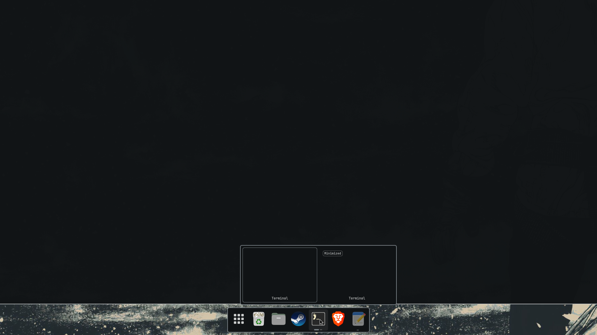
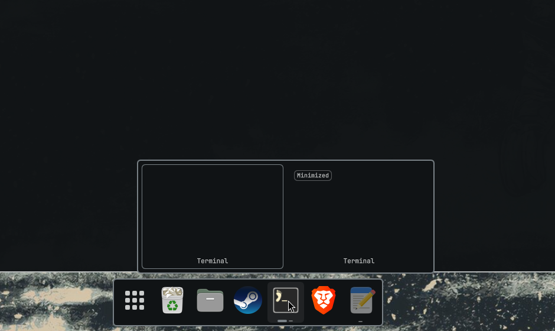
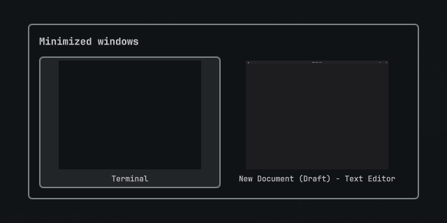
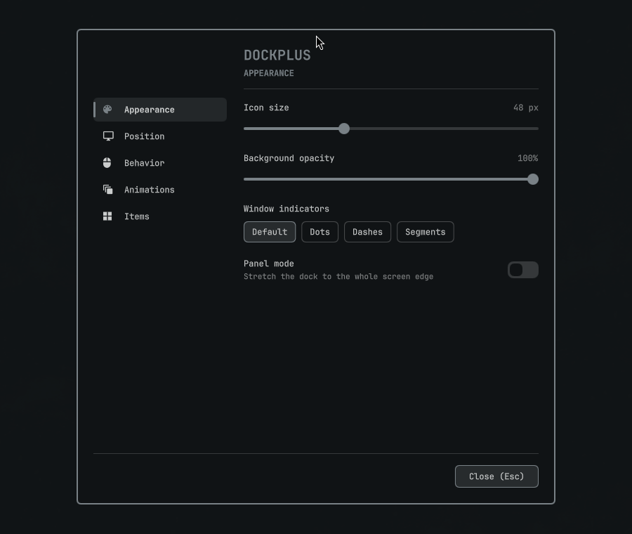
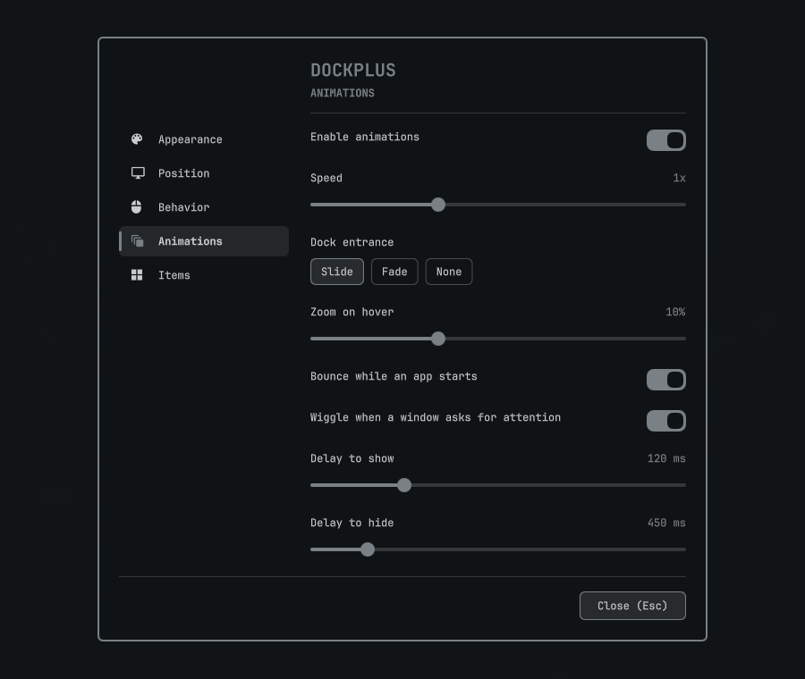
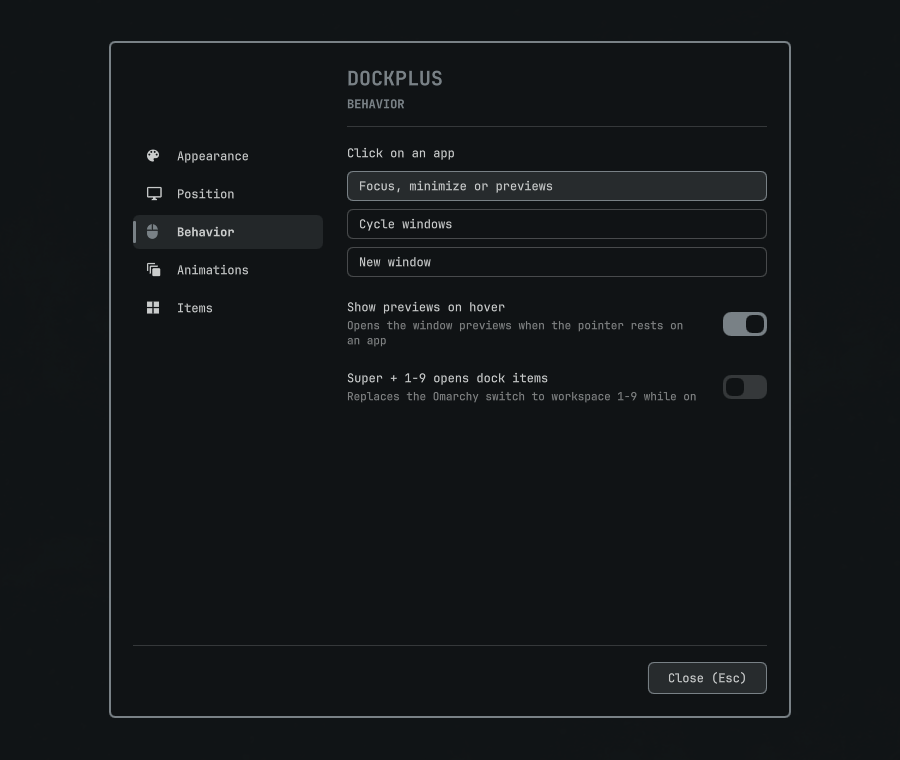
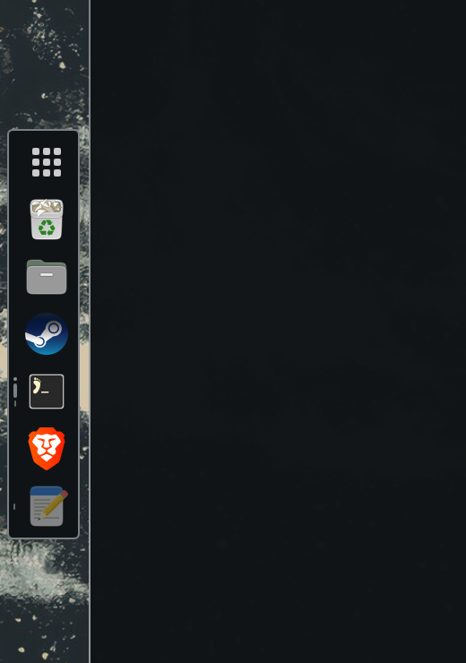

# DockPlus

[](https://omarchy.org/)
[](https://github.com/nventatech/dockplus/releases)
[](https://quickshell.org/)
[](LICENSE)

A Dash to Dock style dock for the Omarchy shell. Hyprland has no minimize, so DockPlus adds one: minimized windows stay on their app icon and come back with a click.



## Features

- One icon per app: pinned apps, running apps and their minimized windows together.
- Real minimize, including the minimize button of X11 apps such as Steam.
- Live window previews on click or on hover, and a picker for every minimized window.
- Right click menu with the app's own actions (Steam Library, a Brave incognito window).
- Drag any icon to reorder it. Drop files on an app to open them, on a drive to copy them, or on the trash to delete them.
- Trash, removable drives, pinned folders and an applications button, each one optional.
- Unread counts and progress bars on the icons, from the apps that publish them.
- Bottom, left or right edge, autohide, panel mode, optional blur, and it stays out of fullscreen games and screen recordings.
- Scroll to cycle windows, a bounce while an app starts and a wiggle when a window asks for attention.
- Settings window with tabs for appearance, position, behavior, animations and items.

## Screenshots

| Previews | Minimized windows |
| --- | --- |
|  |  |

| Settings | Animations |
| --- | --- |
|  |  |

| Behavior | Left edge |
| --- | --- |
|  |  |

## Requirements

Omarchy 4 (Quattro). Everything else ships with Omarchy: `python3` and `python-gobject` for the X11 minimize helper and the icon badges, `udisks2` and `gvfs` for drives and trash, `gtk-launch` and `uwsm` to start apps.

## Install

```bash
omarchy plugin add https://github.com/nventatech/dockplus --enable
```

Right click any icon and pick **Dock settings** to change anything, or run `omarchy-shell dockplus settings`.

## Keybindings

DockPlus adds no keybinding on its own. Add the ones you want to `~/.config/hypr/bindings.lua`.

Omarchy already uses `SUPER + S` for the scratchpad, so unbind it first to put the dock there:

```lua
hl.unbind("SUPER + S")
hl.unbind("SUPER + ALT + S")

o.bind("SUPER + S", "Minimize window", "omarchy-shell dockplus minimize")
o.bind("SUPER + SHIFT + S", "Restore last minimized window", "omarchy-shell dockplus restore")
o.bind("SUPER + ALT + S", "Pick minimized window to restore", "omarchy-shell dockplus pick")
```

Pick another letter if you use the scratchpad. With preinstalled application bindings on, Omarchy already holds `SUPER + SHIFT + S` for Google Maps and `SUPER + SHIFT + M` for Spotify, so run `hyprctl binds` before choosing.

Two settings touch Hyprland while they are on. **Super + 1-9 opens dock items** binds `SUPER + 1..9` to the dock instead of the Omarchy workspace switch, and **Blur behind the dock** adds a layer rule for the dock surface. Both change the running Hyprland configuration only, never your config files, and `hyprctl reload` undoes either one.

Other commands: `omarchy-shell dockplus settings`, `activate <N>`, `pin <appId>`, `unpin <appId>`, `folder <path>`, `unfolder <path>`, `move <appId|@drives|@trash|@apps|@folder:path> <index>` and `position <bottom|left|right>`.

## Configuration

Stored in `~/.config/dockplus/config.json` and edited by the settings window:

- Appearance: `iconSize`, `backgroundOpacity`, `indicatorStyle`, `panelMode`, `blur`.
- Position: `position`, `monitor`, `autohide`.
- Behavior: `clickAction` (`smart`, `cycle`, `launch`), `previewOnHover`, `superNumbers`, `hideWhileRecording`.
- Animations: `animations`, `animationSpeed`, `revealStyle` (`slide`, `fade`, `none`), `hoverZoom`, `launchBounce`, `urgentWiggle`, `showDelay`, `hideDelay`.
- Items: `showPinned`, `showAppsButton`, `showTrash`, `showDrives`, `isolateMonitors`, `isolateWorkspaces`.
- `pinned`: dock order, desktop entry ids plus `@drives`, `@trash`, `@apps` and `@folder:<path>`.

## Tests

```bash
./tests/run.sh
```

Runs the pure logic and the drive parsing in a throwaway Quickshell config. Prints every failing check and exits non zero if any of them failed.

## Limitations

The minimize button drawn by a native Wayland app does nothing. The app sends the request and Hyprland drops it, so nothing outside the compositor ever sees the click. XWayland apps such as Steam work, and an Electron app can be moved to XWayland with `--ozone-platform=x11`. For everything else use your minimize binding or the icon menu.

With the dock on an edge shared with another monitor, the pointer crosses to the other screen instead of stopping. That makes the 2px reveal strip hard to hit while autohide is on.

## Remove

1. Turn off **Super + 1-9 opens dock items** if you turned it on (or run `hyprctl reload` afterwards).
2. Run `omarchy plugin remove io.github.nventatech.dockplus`.
3. Delete `~/.config/dockplus` and any DockPlus lines you added to `bindings.lua`.

## Donate

If DockPlus is useful to you, you can support it through PayPal:

[](https://www.paypal.com/donate/?business=SR28XBBCYSPHE&no_recurring=0&item_name=Help+me+buy+a+coffee.&currency_code=USD)


## License

[GPL-3.0](LICENSE)
